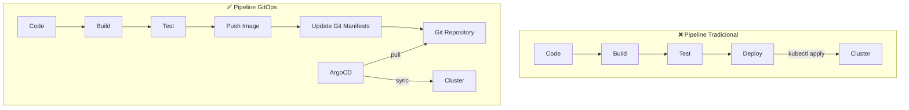
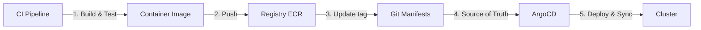

# 🎬 Vídeo 4.2 - Pipeline GitOps Automatizado

**Aula**: 4 - GitOps  
**Vídeo**: 4.2  
**Temas**: CI/CD + GitOps; Update manifests; ArgoCD Sync; Automation  

---

## ⚠️ Pré-requisitos

**IMPORTANTE**: Este vídeo assume que você já tem:
- ✅ Cluster EKS `cicd-lab` criado na **Aula 01** (repositório da Aula 01)
- ✅ ArgoCD instalado e configurado (Vídeo 4.1)
- ✅ kubectl configurado com acesso ao cluster

**Se ainda não criou o cluster:**
- Volte ao **repositório da Aula 01** e crie o cluster EKS
- O cluster deve ter o nome: `cicd-lab`
- Depois retorne ao **Vídeo 4.1** para instalar o ArgoCD

---

## 📚 Parte 1: Conceito CI/CD + GitOps

### Passo 1: Fluxo Completo CI/CD + GitOps



**Separação de responsabilidades:**



| Componente | Responsabilidade |
|------------|------------------|
| **CI Pipeline** | Build, test, push image |
| **Git Repository** | Source of truth para manifests |
| **ArgoCD** | Deploy e sync automático |
| **Cluster** | Executar aplicações |

---

## � Parte 2: Configurar Secrets no GitHub

### Passo 2: Adicionar AWS Credentials como Secrets

**⚠️ IMPORTANTE**: Configure os secrets ANTES de criar os workflows!

**Onde configurar:**
1. Acesse seu repositório no GitHub
2. **Settings** → **Secrets and variables** → **Actions**
3. Clique em **New repository secret**

**Secrets necessários:**

| Secret Name | Descrição | Como obter |
|-------------|-----------|------------|
| `AWS_ACCESS_KEY_ID` | Access Key ID da AWS | AWS Learner Lab → AWS Details → Show |
| `AWS_SECRET_ACCESS_KEY` | Secret Access Key da AWS | AWS Learner Lab → AWS Details → Show |
| `AWS_SESSION_TOKEN` | Session Token (AWS Learner Lab) | AWS Learner Lab → AWS Details → Show |
| `ARGOCD_PASSWORD` | Senha do ArgoCD admin | `kubectl -n argocd get secret argocd-initial-admin-secret -o jsonpath="{.data.password}" \| base64 -d` |

**Passo a passo para adicionar cada secret:**
```
1. Clique em "New repository secret"
2. Name: AWS_ACCESS_KEY_ID
3. Secret: <cole o valor do AWS Learner Lab>
4. Clique em "Add secret"
5. Repita para os outros 3 secrets
```

**⚠️ Nota sobre AWS Learner Lab:**
- Os secrets AWS expiram quando a sessão do Learner Lab termina
- Você precisará atualizar os secrets a cada nova sessão
- Sempre inicie o Learner Lab antes de executar workflows

---

## 🔄 Parte 3: Criar Workflows GitHub Actions

### Passo 3: Criar Estrutura de Diretórios

```bash
# Navegar para o diretório do projeto
cd fiap-dclt-aula04

# Criar estrutura de diretórios
mkdir -p .github/workflows

# Verificar
ls -la .github/workflows/
```

---

## 📦 Parte 4: Criar Pipeline GitOps Unificado

### Passo 4: Entender a Estrutura do Pipeline

**⚠️ Nova Abordagem:**
- **1 único arquivo** em vez de 3 separados
- **4 jobs sequenciais** que executam em ordem
- **Compartilhamento de dados** entre jobs usando `outputs`

**Fluxo do Pipeline:**
```
┌──────────────────────────────────────────────────────────┐
│ Push em app/ → Trigger Pipeline                          │
└──────────────────────────────────────────────────────────┘
                        ↓
┌──────────────────────────────────────────────────────────┐
│ JOB 1: build-and-push                                    │
│ 🐳 Build Docker image e push para ECR                    │
│ Output: image-tag, ecr-registry                          │
└──────────────────────────────────────────────────────────┘
                        ↓ needs: build-and-push
┌──────────────────────────────────────────────────────────┐
│ JOB 2: update-gitops                                     │
│ 📝 Atualiza kustomization.yaml com nova tag              │
│ Faz commit e push das mudanças                           │
└──────────────────────────────────────────────────────────┘
                        ↓ needs: update-gitops
┌──────────────────────────────────────────────────────────┐
│ JOB 3: validate-manifests                                │
│ ✅ Valida manifests com kustomize build                  │
└──────────────────────────────────────────────────────────┘
                        ↓ needs: all
┌──────────────────────────────────────────────────────────┐
│ JOB 4: pipeline-summary                                  │
│ 📊 Mostra resumo completo do pipeline                    │
└──────────────────────────────────────────────────────────┘
```

### Passo 5: Criar gitops-pipeline.yml

**📋 Arquivo Completo:**

O arquivo completo está disponível em `.github/workflows/gitops-pipeline.yml` no repositório.

**Vamos criar passo a passo:**

**Linux / macOS:**
```bash
# Navegar para o diretório do projeto
cd fiap-dclt-aula04

# Criar estrutura de diretórios
mkdir -p .github/workflows

# Criar arquivo gitops-pipeline.yml
cat > .github/workflows/gitops-pipeline.yml << 'EOF'
name: 🚀 GitOps Pipeline - Build, Update & Sync

on:
  push:
    branches: [ main ]
    paths: 
      - 'app/**'
  workflow_dispatch:

permissions:
  contents: write

env:
  AWS_REGION: us-east-1
  ECR_REPOSITORY: fiap-todo-api
  ARGOCD_SERVER: 'localhost:8080'
  ARGOCD_APP_NAME: 'fiap-todo-api'

jobs:
  # ============================================
  # JOB 1: Build e Push da Imagem Docker
  # ============================================
  build-and-push:
    name: 🐳 Build and Push Docker Image
    runs-on: ubuntu-latest
    outputs:
      image-tag: ${{ steps.set-tag.outputs.tag }}
      ecr-registry: ${{ steps.login-ecr.outputs.registry }}
    
    steps:
      - name: 📥 Checkout código
        uses: actions/checkout@v4
      
      - name: 🔑 Configure AWS credentials
        uses: aws-actions/configure-aws-credentials@v4
        with:
          aws-access-key-id: ${{ secrets.AWS_ACCESS_KEY_ID }}
          aws-secret-access-key: ${{ secrets.AWS_SECRET_ACCESS_KEY }}
          aws-session-token: ${{ secrets.AWS_SESSION_TOKEN }}
          aws-region: ${{ env.AWS_REGION }}
      
      - name: 🔐 Login to Amazon ECR
        id: login-ecr
        uses: aws-actions/amazon-ecr-login@v2
      
      - name: 🏷️ Set image tag
        id: set-tag
        run: echo "tag=${{ github.sha }}" >> $GITHUB_OUTPUT
      
      - name: 🐳 Build, tag, and push image
        env:
          ECR_REGISTRY: ${{ steps.login-ecr.outputs.registry }}
          IMAGE_TAG: ${{ steps.set-tag.outputs.tag }}
        run: |
          echo "🔨 Building Docker image..."
          docker build --platform linux/amd64 -t $ECR_REGISTRY/$ECR_REPOSITORY:$IMAGE_TAG .
          
          echo "📤 Pushing to ECR..."
          docker push $ECR_REGISTRY/$ECR_REPOSITORY:$IMAGE_TAG
          
          echo "✅ Image pushed: $ECR_REGISTRY/$ECR_REPOSITORY:$IMAGE_TAG"
      
      - name: 📊 Build Summary
        env:
          ECR_REGISTRY: ${{ steps.login-ecr.outputs.registry }}
          IMAGE_TAG: ${{ steps.set-tag.outputs.tag }}
        run: |
          echo "## 🐳 Docker Build Summary" >> $GITHUB_STEP_SUMMARY
          echo "" >> $GITHUB_STEP_SUMMARY
          echo "**Image:** \`$ECR_REGISTRY/$ECR_REPOSITORY:$IMAGE_TAG\`" >> $GITHUB_STEP_SUMMARY
          echo "**Status:** ✅ Built and Pushed to ECR" >> $GITHUB_STEP_SUMMARY

  # ============================================
  # JOB 2: Atualizar Manifests GitOps
  # ============================================
  update-gitops:
    name: 📝 Update GitOps Manifests
    runs-on: ubuntu-latest
    needs: build-and-push
    
    steps:
      - name: 📥 Checkout código
        uses: actions/checkout@v4
        with:
          token: ${{ secrets.GITHUB_TOKEN }}
      
      - name: 🔧 Setup Kustomize
        run: |
          curl -s "https://raw.githubusercontent.com/kubernetes-sigs/kustomize/master/hack/install_kustomize.sh" | bash
          sudo mv kustomize /usr/local/bin/
          kustomize version
      
      - name: 📝 Update image tag in kustomization
        env:
          ECR_REGISTRY: ${{ needs.build-and-push.outputs.ecr-registry }}
          IMAGE_TAG: ${{ needs.build-and-push.outputs.image-tag }}
        run: |
          cd gitops-repo/applications/fiap-todo-api/overlays/production
          
          echo "🔄 Updating image tag to: $IMAGE_TAG"
          kustomize edit set image \
            fiap-todo-api=$ECR_REGISTRY/$ECR_REPOSITORY:$IMAGE_TAG
          
          echo "✅ Kustomization updated"
          cat kustomization.yaml
      
      - name: 💾 Commit and push changes
        env:
          IMAGE_TAG: ${{ needs.build-and-push.outputs.image-tag }}
        run: |
          git config user.name "GitHub Actions Bot"
          git config user.email "actions@github.com"
          
          git add gitops-repo/applications/fiap-todo-api/overlays/production/kustomization.yaml
          
          if git diff --staged --quiet; then
            echo "⚠️ No changes to commit"
          else
            git commit -m "🚀 Update production image to $IMAGE_TAG"
            git push origin main
            echo "✅ Changes pushed to repository"
          fi
      
      - name: 📊 GitOps Summary
        env:
          IMAGE_TAG: ${{ needs.build-and-push.outputs.image-tag }}
        run: |
          echo "## 📝 GitOps Update Summary" >> $GITHUB_STEP_SUMMARY
          echo "" >> $GITHUB_STEP_SUMMARY
          echo "**Environment:** production" >> $GITHUB_STEP_SUMMARY
          echo "**New Image Tag:** \`$IMAGE_TAG\`" >> $GITHUB_STEP_SUMMARY
          echo "**Status:** ✅ Manifests Updated and Committed" >> $GITHUB_STEP_SUMMARY

  # ============================================
  # JOB 3: Validar Manifests
  # ============================================
  validate-manifests:
    name: ✅ Validate Manifests
    runs-on: ubuntu-latest
    needs: update-gitops
    
    steps:
      - name: 📥 Checkout código
        uses: actions/checkout@v4
        with:
          ref: main
      
      - name: 🔧 Setup Kustomize
        run: |
          curl -s "https://raw.githubusercontent.com/kubernetes-sigs/kustomize/master/hack/install_kustomize.sh" | bash
          sudo mv kustomize /usr/local/bin/
      
      - name: ✅ Validate Kubernetes manifests
        run: |
          echo "🔍 Validating manifests..."
          cd gitops-repo/applications/fiap-todo-api/overlays/production
          
          kustomize build . > /tmp/manifests.yaml
          
          echo "✅ Manifests are valid"
      
      - name: 📊 Validation Summary
        run: |
          echo "## ✅ Validation Summary" >> $GITHUB_STEP_SUMMARY
          echo "" >> $GITHUB_STEP_SUMMARY
          echo "**Status:** ✅ Manifests Validated" >> $GITHUB_STEP_SUMMARY
          echo "**Note:** ArgoCD will auto-sync in ~3 minutes" >> $GITHUB_STEP_SUMMARY

  # ============================================
  # JOB 4: Pipeline Summary
  # ============================================
  pipeline-summary:
    name: 📊 Pipeline Summary
    runs-on: ubuntu-latest
    needs: [build-and-push, update-gitops, validate-manifests]
    if: always()
    
    steps:
      - name: 📊 Complete Pipeline Summary
        env:
          IMAGE_TAG: ${{ needs.build-and-push.outputs.image-tag }}
          ECR_REGISTRY: ${{ needs.build-and-push.outputs.ecr-registry }}
        run: |
          echo "## 🚀 GitOps Pipeline Complete" >> $GITHUB_STEP_SUMMARY
          echo "" >> $GITHUB_STEP_SUMMARY
          echo "### Pipeline Steps:" >> $GITHUB_STEP_SUMMARY
          echo "1. 🐳 **Build & Push:** ✅ Image built and pushed to ECR" >> $GITHUB_STEP_SUMMARY
          echo "2. 📝 **Update GitOps:** ✅ Manifests updated in Git" >> $GITHUB_STEP_SUMMARY
          echo "3. ✅ **Validate:** ✅ Manifests validated" >> $GITHUB_STEP_SUMMARY
          echo "" >> $GITHUB_STEP_SUMMARY
          echo "### Deployment Details:" >> $GITHUB_STEP_SUMMARY
          echo "- **Image:** \`$ECR_REGISTRY/$ECR_REPOSITORY:$IMAGE_TAG\`" >> $GITHUB_STEP_SUMMARY
          echo "- **Environment:** production" >> $GITHUB_STEP_SUMMARY
          echo "- **Status:** 🎉 **READY - ArgoCD will deploy automatically**" >> $GITHUB_STEP_SUMMARY
EOF

echo "✅ Arquivo gitops-pipeline.yml criado com sucesso!"
```

---

## 📋 Resumo do Arquivo Criado

**Principais seções do arquivo:**

#### 1. Configuração Inicial
```yaml
name: 🚀 GitOps Pipeline - Build, Update & Sync

permissions:
  contents: write  # Necessário para commit no Job 2

env:
  AWS_REGION: us-east-1
  ECR_REPOSITORY: fiap-todo-api
```

#### 2. Job 1 - Build and Push
```yaml
build-and-push:
  outputs:
    image-tag: ${{ steps.set-tag.outputs.tag }}
    ecr-registry: ${{ steps.login-ecr.outputs.registry }}
  steps:
    - Build Docker image
    - Push para ECR
    - Exporta tag e registry para próximos jobs
```

#### 3. Job 2 - Update GitOps
```yaml
update-gitops:
  needs: build-and-push  # Espera Job 1
  steps:
    - Setup Kustomize
    - Update kustomization.yaml com nova tag
    - Commit e push das mudanças
```

#### 4. Job 3 - Validate
```yaml
validate-manifests:
  needs: update-gitops  # Espera Job 2
  steps:
    - Checkout latest code
    - Validate com kustomize build
```

#### 5. Job 4 - Summary
```yaml
pipeline-summary:
  needs: [build-and-push, update-gitops, validate-manifests]
  if: always()  # Roda mesmo se houver falha
  steps:
    - Mostra resumo completo do pipeline
```

### Passo 6: Verificar Arquivo Criado

```bash
# Ver arquivo
cat .github/workflows/gitops-pipeline.yml

# Verificar estrutura
ls -la .github/workflows/

# Deve mostrar apenas:
# gitops-pipeline.yml
```

---

## 🧪 Parte 5: Testar o Pipeline

### Passo 7: Fazer Commit e Push

```bash
# Adicionar arquivo
git add .github/workflows/gitops-pipeline.yml

# Commit
git commit -m "feat: adicionar pipeline GitOps unificado"

# Push
git push origin main
```

### Passo 8: Testar Pipeline com Mudança no App

```bash
# Fazer mudança no código
echo "// Test pipeline" >> app/src/app.js

# Commit e push
git add app/
git commit -m "test: trigger pipeline"
git push origin main
```

### Passo 9: Acompanhar Execução

**No GitHub:**
1. Acesse: `https://github.com/SEU_USUARIO/fiap-dclt-aula04/actions`
2. Veja o workflow "🚀 GitOps Pipeline - Build, Update & Sync"
3. Clique para ver detalhes

**Você verá 4 jobs executando em sequência:**
```
✅ Job 1: 🐳 Build and Push Docker Image
   ↓
✅ Job 2: 📝 Update GitOps Manifests
   ↓
✅ Job 3: ✅ Validate Manifests
   ↓
✅ Job 4: 📊 Pipeline Summary
```

---

## 🎯 Parte 6: Entender o Fluxo Completo

### Fluxo End-to-End Automático

```
1. Developer faz push em app/
   ↓
2. GitHub Actions detecta mudança
   ↓
3. Job 1: Build image e push para ECR
   ↓
4. Job 2: Atualiza kustomization.yaml automaticamente
   ↓
5. Job 3: Valida manifests
   ↓
6. Job 4: Mostra resumo
   ↓
7. ArgoCD detecta mudança no Git (auto-sync ~3min)
   ↓
8. ArgoCD aplica mudanças no cluster
   ↓
9. Pods são atualizados com nova imagem
```

### Verificar Deployment

```bash
# Ver pods sendo atualizados
kubectl get pods -n fiap-todo-prod -w

# Ver status no ArgoCD
kubectl port-forward svc/argocd-server -n argocd 8080:443

# Abrir: http://localhost:8080
# Ver aplicação sincronizando automaticamente
```

---

**FIM DO VÍDEO 4.2** ✅